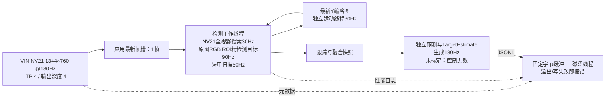

# OS04A10 全视野 180fps 业务接入验证 · 2026-09-08

本报告区分实现、采集连续性、检测调用频率与比赛验收。无相机标定、真实 Pose 模型、
目标真值和曝光时刻证据时，不宣称控制安全或识别准确率。

## 当前结论与复测版本

当前候选为源码`0033c38`，独立构建`.maixpy/business-full180-fused/`；完整哈希见
[构建证据](../artifacts/business_full180_20260908/build.json)。5秒、30秒空载和2分钟全阶段
压力均通过采集连续性及资源归还检查。两分钟采集180.136fps、绿灯检测调用89.397Hz、
装甲扫描59.920Hz、TargetEstimate生成180.004Hz，接收后源年龄P95 21.478ms。
同一构建30分钟复测通过采集连续性检查：324245帧、180.135791fps、上游序号异常0，
DMA全部归还，软件源年龄P95 22.992ms。之前836秒长测失败及修复记录保留在后文。

本次没有人工目标真值；长测中检测器自报直接绿灯观测10.433Hz，不能认定是真实目标
或推算准确率，也未验证目标可见时直接测量≥60Hz。没有标定、曝光时间真值或
控制通信，因此比赛门槛尚未完成。后文性能表中的“控制”统一指本地TargetEstimate生成。

## 本轮开始时的真实状态

仓库干净，HEAD `9eae1c8`，前一业务基线 `0f3018e`。交接文档中高帧率工具未提交的
描述已过时。共享 MaixCDK 干净，commit `2a0502ecb20e5695b28580b3689492b7a228f9e4`，
MSP `3.0.0_20250319114413`；原有 `build/` 为 MinSizeRel AArch64。
设备 `10.18.197.1`，系统 4.19.125 / 2026-05-29，启动器运行、autostart=none。
系统 OS04A10 库 SHA256 为 `25f1d2c4e9fdef213dca3fdecf09f98a61d9a52c0704ade31cf6070aeab5bb4c`。

## 架构与数据语义



图像帧只在VIN lease与应用槽/当前消费者之间转移所有权；磁盘线程只接收字节，
运动线程只接收已复制的缩略图，均不延长DMA帧所有权。

- 独立 `business_capture` 复用 `official_capture.cpp` 的官方模式、sensor 对象绑定、
  SYS/VI 初始化、chip ID 校验、健康监测及退出流程。没有另写寄存器表，也没有修改共享 SDK。
- 使用直接 `AX_VIN_GetYuvFrame` 的实际 NV21 路径，**不经过公共 Camera::pop/IVPS**。
  因此本报告不能修复或替代先前 Camera/IVPS 的缺号验收。
- full180 采用厂商池和输出深度 4，ITP source depth=4，均读回检查。
  裁剪模式的 output depth=8 不直接套入本次全视野池。
- 应用只有一个待处理帧槽，另有消费者当前持有的一帧；发布覆盖后归还旧帧。
  每个 VIN lease 在 CPU 读取前映射并 invalidate，消费者结束后 unmap，再 ReleaseYuvFrame。
  退出先关闭槽、join 工作线程、释放所有帧，再显式 deinit VI。
- 为保持旧CSV兼容，业务`frames.csv`中的`hold_us`目前表示采集线程分发用时，**不是消费者最终归还前的完整持帧时长**；实际释放完备性看`leases.json`，处理年龄看`vision.csv`。
- NV21→RGB按BT.601 limited-range计算，这是待色卡核验的颜色矩阵假设。
- 序号为 SDK `u64SeqNum`，PTS 为 SDK `u64PTS` 原值。没有假设计数回绕位宽；下降单列为异常。
  PTS 实测约每秒一百万 ticks，但 SDK 没有说明曝光/SOF/EOF 对应关系或与主机时钟的偏移。
  调度使用明确标记的主机单调接收时间，**不是曝光时间**。
- `measurement_age_us` 保留真实检测测量的年龄；源帧 seq/PTS/receive、应用丢弃与上游异常
  均进入 JSON。接收后年龄只是曝光年龄的下界，真正曝光到控制的端到端延迟仍为未验证。
- 绿色搜索直接遍历 NV21 的 2×2 色度格（等效 672×380 全视野网格），结合每格四个 Y
  的最大值产生最多五个候选。候选回原图 96×96 ROI 做既有 v0.2 精定位；锁定 ROI 随
  目标尺寸在 128～384 调整。装甲扫描限于同一原图 ROI。
- 既有候选评分、多假设和归一化 Kalman 状态复用。ROI 平移只改变图像原点，候选、绿灯、
  装甲中心和端点都恢复到 1344×760 坐标。
- 检测线程按时间戳争取 90Hz、全场搜索 30Hz、装甲扫描60Hz；运动线程消费最新168×95全视野亮度缩略图（直接Y采样），争取30Hz。输出线程使用跟踪
  快照按 180Hz 独立预测。调度过期跳过，不追赶旧任务。压力选项强制运动和装甲扫描，
  仅增加真实图像工作量，不注入假观测。
- ROI专用整数积分统计复用相同精检测公式和256/128候选预算。随机图与边界目标测试验证候选位置、分数和数量与原计算一致；不以减少候选制造提速。
- `max_missed_frames` / `control_prediction_max_frames` 计算失败的**测量次数**；180Hz 输出预测
  不消耗该计数，35ms 控制年龄预算仍保留。无标定时最终控制门始终关闭。
- 180Hz 输出指 TargetEstimate 生成时间戳；本地 JSONL 经过缓冲异步写盘，文件可见时间及 UART/CAN 传输延迟未测量，UART/CAN 仍未实现。
- 异步日志使用固定预分配字节环：targets 8MiB、frames/vision各1MiB、motion 256KiB、progress 64KiB。磁盘线程在锁外写入；生产者只作有界内存复制。溢出或写失败明确终止，不丢弃指标伪造通过。退出排空并join，`*.io.json`记录高水位、写入字节及最大写调用耗时。业务进度改为追加`progress.jsonl`。
- VIN `_after` proc统计在业务线程退出之后读取，含预热及停止消费到VI关闭期间；CHN累计drop不能直接充当测量窗口内缺号。测量序列连续性以完整`frames.csv`逐行审计。
- 独立配置里的相机数值仅作为像素归一化尺度，非旧内参缩放，非实测标定。
  新入口始终清除 `angles_valid`、LOS、角速度、pose.valid 和 safe_for_control。
  NPU/pose 启用会被拒绝；未来异步模型接口尚未接通，不能用占位模型解除此门。

## 已运行记录

| 版本 / 测试 | VIN NV21 fps | 上游缺号 | 绿灯检测调用 Hz | 控制输出 Hz | 结论 |
| --- | ---: | ---: | ---: | ---: | --- |
| v1，5s，192 ROI | 180.134 | 0 | 73.8 | 约180 | 短测、DMA归还和启动器恢复通过 |
| v2，30s空载 | 180.137 | 0 | 0 | 179.867 | 5404帧、5765含预热帧全部释放 |
| v2，120s，192 ROI | 180.136 | 0 | 71.038 | 179.988 | 21616帧；软件源年龄P95 32.433ms，超30ms，未进入长测 |
| v3/v4，曝光读回检查 | 未测量 | 未测量 | 未测量 | 未测量 | 500µs请求读回494µs，检查拦截；v4异常退出139，保留失败 |

证据目录（本地、Git忽略）：

- `.maixpy/runs/os04a10-20260908-193741-de759b/`
- `.maixpy/runs/os04a10-20260908-194044-cefbd4/`
- `.maixpy/runs/os04a10-20260908-194209-aea6f5/`
- `.maixpy/runs/os04a10-20260908-194557-04db8c/`
- `.maixpy/runs/os04a10-20260908-194830-ee795b/`

v2 两分钟测试：全视野搜索 30.002Hz；没有确认目标，运动与装甲阶段未运行，因此该次
不能算全部阶段压力通过。接收到视觉处理结束 P95 20.938ms，输出引用的源帧年龄
P50/P95/P99/max 为 23.878/32.433/38.094/75.668ms；RSS 首末 22856/23420KB，
最高内部温度60.373°C，MIPI错误0。检测调用率不是直接检出率。

曝光诊断确认读回 494µs 符合 VTS=819 / 180fps 下约6.8µs的行量化。后续检查使用
读回 VTS 推导单行容差，保留请求/实际值并检查 AE 禁用状态，不要求不可实现的精确500µs。
异常路径另加显式 VI 清理。异常后原始驱动 5秒151帧、约30.283fps复测通过。
用6000µs无效配置再次触发初始化后的拒绝路径（`.maixpy/runs/os04a10-20260908-195403-dadcc8/`），
程序返回预期8且正常释放VI。WB有界等待后读回与请求一致：R/Gr/Gb/B=517/256/256/443。

v5/v7/v8强制装甲与运动阶段的10秒对照均无采集缺号，但软件源年龄P95分别
32.854/33.615/33.009ms，均未作为延迟通过。v8分段定位到绿灯P50 5.482ms、
装甲与融合P50 4.800ms，因此后续将装甲独立调度到60Hz，并明确缓存不重复增加命中计数。


## 主机验证

- 原 v0.2 回归、最新帧替换/并发/唤醒退出、源序号分类与时间戳调度通过。
- 480×360、640×480、1344×760 合成 NV21 验证跨分辨率、带 stride 的 VU 转换及原图精定位。
- 任意滚转装甲中心/端点的 ROI→源图映射通过。
- DMA 映射/invalidate/unmap/release 顺序及失败注入、业务线程 map 异常与幂等退出通过。
- ASan/UBSan/LeakSanitizer 与 TSan 四组 CTest 通过。LSan 需离开 ptrace 沙箱；TSan 需
  `setarch x86_64 -R` 固定测试进程地址布局；没有关闭错误检查。
- 高帧率工具原13项及新增业务指标测试，共14项Python回归通过。主机测试不证明设备吞吐量或真实目标准确率。

## 验收边界与所需外部数据

真正曝光到控制延迟、捕获后控制无效间隔、15/20/25m捕获率和误报率仍不能从这些日志得出。
需要固定比赛镜头的1344×760内参/畸变、曝光/增益/WB扫描、目标实物几何、同步光源或运动
时间真值，以及人工标注的远距离动态绿灯与红蓝装甲录像。640×360@360保留独立工具及
模式，需要另一套标定；当前不实现飞行中动态模式切换。

## 最终候选构建的短测

96像素初始精定位ROI、128～384锁定ROI、绿灯90Hz目标/装甲60Hz/异步运动30Hz：

| 测试 | NV21 fps | 绿灯调用 Hz | 装甲调用 Hz | 搜索/运动 Hz | 控制 Hz | 软件源年龄P95 |
| --- | ---: | ---: | ---: | ---: | ---: | ---: |
| 10s强制全阶段 | 180.136 | 89.668 | 59.945 | 30.023 / 30.023 | 180.000 | 20.740ms |
| 30s空载 | 180.138 | 0 | 0 | 0 / 0 | 180.000 | 无视觉源 |

两次均零上游异常、正常退出；原始记录分别为
`.maixpy/runs/os04a10-20260908-200944-dd5086/`、
`.maixpy/runs/os04a10-20260908-201102-81701b/`。
空载RSS首末23016/23040KB。此处仍是静态桌面图像，不能证明最大384像素跟踪ROI、
动态真实目标、曝光到控制时延或比赛准确率已经通过。

## 两分钟全阶段压力复验

最终候选（v11仅另修正累计进度帧数）的记录为
`.maixpy/runs/os04a10-20260908-201246-d069bd/`：

| 测量项 | 结果 |
| --- | --- |
| VIN NV21应用取得 | 21616帧，180.136038fps |
| 上游缺号/重复/逆序、PTS非递增 | 全部0 |
| 取得/释放/DMA错误 | 全部0，含预热21981帧全部释放 |
| 应用替换旧帧 / 定时主动跳过 | 2101 / 8802；正常且分别记录 |
| 绿灯检测调用 / 装甲扫描 | 89.280 / 59.870Hz |
| 全视野搜索 / 运动补偿 | 30.002 / 30.002Hz |
| TargetEstimate输出 | 180.006Hz |
| 接收后源年龄P50/P95/P99/max | 14.001 / 21.139 / 29.850 / 59.569ms |
| 绿灯精检测P95 | 5.070ms |
| 装甲和融合P95 | 4.101ms（含未调度帧的融合成本） |
| 原图ROI RGB转换P95 | 1.181ms |
| 全视野搜索P95 | 2.309ms（含未调度帧） |
| 运动工作线程P95 | 0.350ms |
| RSS首末 / P50/P95/max | 23024/23556KB；23556/23556/23556KB |
| 进程CPU，单核100%口径 | 124.922%（双核总容量200%） |
| CPU频率采样 | 1200000kHz |
| 内部温度最高 / MIPI错误 | 60.298°C / 0 |

这里只验证当前静态图像上的强制阶段工作量。没有确认的真实目标，`direct_green_observation_hz=0`；
89.280Hz是检测调用频率，不能写成已证实的直接观测频率、召回率或捕获率。
同样，所有控制输出都保持无效；“捕获后无效间隔≤50ms”没有可用真值，尚未验收。

## 可复现主机检查与构建边界

```bash
DART_AX_HEADERS="$MAIXCDK_PATH/components/3rd_party/maixcam2_msp/msp/out/arm64_glibc/include"
cmake -S tests -B build/tests-180 -DCMAKE_BUILD_TYPE=Debug \
  -DAX_SDK_INCLUDE="$DART_AX_HEADERS"
cmake --build build/tests-180 -j4
ctest --test-dir build/tests-180 --output-on-failure
python3 -m unittest discover -s tools/os04a10_highfps -p 'test_*.py'
```

ASan构建增加 `-DCMAKE_CXX_FLAGS='-fsanitize=address,undefined -fno-omit-frame-pointer'`、
`-DCMAKE_EXE_LINKER_FLAGS='-fsanitize=address,undefined'`；TSan另建目录并将sanitizer改为
`thread`。在本机WSL中用 `setarch x86_64 -R ctest --test-dir build/tests-180-tsan --output-on-failure`。
只改变测试子进程的地址布局，不全局改变ASLR，也不禁用错误检查。

标准相机应用入口另用原SDK参数交叉编译检查通过；已有稳定可执行文件未覆盖。
`business_capture`使用O2，其余编译/链接参数来自当前固定SDK工程。
最终源、二进制与配置哈希见[构建证据](../artifacts/business_full180_20260908/build.json)。
当前完整构建为 `.maixpy/business-full180-fused/`（源码`0033c38`）；原始逐帧数据保留在各run目录，
精简可版本化记录位于 `artifacts/business_full180_20260908/`。

手动终止的长测 `.maixpy/runs/os04a10-20260908-201556-1e4f66/` 只完成397.378秒，
71583帧，180.136fps；零序号异常，但SIGTERM时保留了1次取帧中断，`interrupted=true`。
71947个含预热帧全部释放。这是审查修正取时顺序时主动结束的记录，**不算30分钟通过**。
随后冻结构建的5秒与两分钟复验分别见
`.maixpy/runs/os04a10-20260908-202444-f356bc/`、
`.maixpy/runs/os04a10-20260908-202612-a1e4c3/`；后者绿灯调用89.805Hz、控制179.992Hz、
软件源年龄P95 18.650ms，无负年龄或输出时间倒序。

## 30分钟尝试的连续性失败与日志隔离修复

冻结构建 `0dbb97c` 的长测 `.maixpy/runs/os04a10-20260908-202951-1d45ee/` 在
836.495秒自动停止，返回10：150389帧，平均179.784fps。源序号从150774跳到151066，
缺291帧，无重复/逆序/PTS倒退。对应取帧间隙1640279µs，而GetYuvFrame本次仅65µs；
说明主要停顿发生在采集循环的两次SDK调用之间。IFE/ITP结束快照仍180.1fps、输入drop=0，
CHN累计drop=315（含退出阶段），MIPI错误0。150754个含预热帧全部释放，map/release错误0。
这是业务采集失败，**不算30分钟通过**，也不能用传感器平均帧率掩盖。

该次绿灯调用89.521Hz、装甲59.849Hz、控制生成179.989Hz；接收后源年龄
P50/P95/P99/max为11.349/18.989/24.374/70.817ms。RSS首末23112/23660KB，
最高温67.957°C。上次实现允许采集线程同步写逐帧CSV和进度文件，磁盘I/O是待验证的
阻塞来源；现有日志不足以唯一证明1.64秒停顿全部来自磁盘，亦不能排除调度/内存回收。

修复将采集、视觉、运动及控制日志交给有界磁盘线程，增加写延迟和缓冲高水位审计；
没有增大VIN队列、放宽序号检查、改系统设置或改传感器时序。新主机测试覆盖阻塞sink
不阻塞生产者、缓冲绕回、显式溢出/磁盘错误和排空退出，四组CTest及消毒器均通过。
故障后原始库5秒恢复复测 `.maixpy/runs/os04a10-20260908-204901-774779/` 通过，
151帧、30.281fps；启动器运行、autostart=none、系统库SHA保持原值。

修复构建 `.maixpy/business-full180-asyncio/` 的5秒和30秒空载已依次通过，分别为
`205236-388408`（180.118fps）与`205330-f9833d`（180.135fps），零上游异常，全部DMA归还。
固定日志缓冲使RSS基线增加约11MiB；这是有界预分配成本，不是图像队列增长。

输出复查另修正了180Hz预测重置装甲融合模式的问题：保留已测量的`FUSED/ARMOR_IMPACT`
及融合瞄准点相对绿灯的偏移，以绿灯预测作短时共同平移；装甲端点本身仍为源时刻观测，
不伪造成新检测。`armor_source_received_us`单独记录装甲观测时间，到期回到绿灯模式。
合成测试验证融合保持、真实观测时间过期、失流回SEARCH及未标定安全门。

异步日志修复的2分钟压力 `205448-22795b`：21617帧、180.136fps、零序号异常，
绿灯/装甲调用89.635/59.967Hz、生成180.000Hz，软件源年龄P95 20.861ms；
所有日志高水位4096字节，无溢出，targets写调用最大3.259ms。

## 最终候选的顺序短测

| 阶段 / run后缀 | NV21帧数 / fps | 上游异常 | 绿灯 / 装甲调用Hz | TargetEstimate Hz | 接收后年龄P95 |
| --- | --- | --- | --- | --- | --- |
| 5s / 205834-8d9f51 | 900 / 180.135 | 0 | 89.967 / 60.112 | 180.020 | 20.341ms |
| 30s空载 / 205938-5a29e4 | 5405 / 180.136 | 0 | 0 / 0 | 179.901 | 无视觉源 |
| 120s压力 / 210050-bee2cc | 21616 / 180.136 | 0 | 89.397 / 59.920 | 180.004 | 21.478ms |

2分钟压力的搜索/运动均30.002Hz；接收后年龄P50/P95/P99/max为
12.722/21.478/27.539/63.694ms。RSS首末34028/34548KB，最高温61.208°C，
MIPI错误0，全部21981个lease释放。targets磁盘写调用最大4.620ms，日志队列最高4096字节。
这些数据验证当前图像工作量，最大384像素跟踪ROI和高速真实目标需另做压力验收。

## 下一轮实物数据交接

1. 固定比赛镜头、焦距和安装，单独采集1344×760模式的标定板图像并保存内参、畸变、
   标定误差和版本；不能使用480×360/640×480内参缩放。
2. 15m、20m、25m各保存红蓝装甲、绿灯出现/消失、横移、滚转、运动模糊、遮挡及
   无目标硬负样本。记录距离、曝光/增益/WB、场景光照及镜头状态。
3. 人工标注目标可见区间、绿灯中心、四个灯条端点和颜色。真值应绑定图像的
   `source_sequence`/PTS；同一观测会生成多个预测输出，不能重复计作多次独立检出。
   图像录制吞吐和序号对应关系需单独验收，当前业务日志不是图像录像。
4. 用同步光源或有时间真值的运动测曝光到输出延迟；在接通UART/CAN后测完整控制传输。
   之后才能评价捕获后最长无效间隔和15m捕获率、误报率。
5. 提供真实Pose模型后再接异步NPU工作线程并重新做负载/安全验收；现阶段禁止用占位
   结果解除模型或标定失效门。

## 最终30分钟压力复测与恢复

证据：`.maixpy/runs/os04a10-20260908-210340-947ede/`，源码`0033c38`，二进制
SHA256 `fadaccea19adf4d51b3336b1fc62027d24cf9856066c59684aee792ff0e05632`。
[精简审计与原始文件哈希](../artifacts/business_full180_20260908/210340-947ede.json)。

| 测量项 | 结果 |
| --- | --- |
| 测量时长 / 进程退出 | 1799.997647秒（首末帧窗口），退出0，未中断 |
| Sensor/VIN IFE输入 | 结束proc快照180.1fps，IFE/ITP drop与LostCnt为0 |
| NV21通道输出 | 结束proc快照180.1fps；累计CHN drop 21，见下面窗口解释 |
| 应用NV21取得 | 324245帧，180.135791fps |
| 测量源序号范围 | 386～324630，逐帧连续 |
| 上游缺号 / 重复 / 逆序 / PTS非递增 | 0 / 0 / 0 / 0 |
| 取帧 / DMA map / release错误 | 0 / 0 / 0 |
| 含预热的取得 / 释放 | 324610 / 324610 |
| 应用最新槽替换 / 时间调度跳过 / 退出丢弃 | 32301 / 132334 / 0 |
| 绿灯检测调用 | 159610次，88.672Hz |
| 检测器自报直接绿灯观测 | 18780次，10.433Hz；无人工真值，正确性未测 |
| 装甲检测调用 | 107625次，59.792Hz |
| 全视野搜索 / 运动工作线程 | 29.999 / 29.999Hz |
| TargetEstimate生成 | 179.998Hz；safe_for_control为true的输出0条 |
| CPU平均，单核100%口径 | 118.552%，双核总容量为200% |
| CPU频率采样 | 全部1200000kHz；未观察到采样时降频 |
| RSS首 / 末 / 最大 | 34032 / 34716 / 35012KB |
| 最高内部温度 / MIPI错误 | 66.984°C / 0 |
| 负软件源年龄 / 输出时间不递增 | 0 / 0 |

CHN累计统计不能省略：`OutFrmCnt=324632`，正好等于全部取得324610 + drop21 +
仍在通道中的1帧。该统计包含启动、预热和退出；测量范围386～324630没有缺号。
现有证据支持测量窗口内连续，不把启动/退出累计drop写成0，也不把它误算为业务窗口缺帧。

| 时间项（ms） | P50 | P95 | P99 | max |
| --- | ---: | ---: | ---: | ---: |
| 接收到视觉线程开始 | 0.083 | 3.372 | 4.775 | 11.310 |
| 接收到视觉完成 | 6.538 | 14.705 | 21.299 | 48.609 |
| 输出引用的源帧接收后年龄 | 13.130 | 22.992 | 33.298 | 90.450 |
| 检测与融合总耗时 | 4.177 | 7.450 | 10.744 | 38.746 |
| 绿灯精检测 | 3.538 | 5.675 | 8.491 | 32.764 |
| 装甲与融合，仅实际扫描的任务 | 1.006 | 2.891 | 4.697 | 27.140 |
| NV21全场搜索，仅实际搜索任务 | 3.117 | 4.295 | 7.940 | 24.745 |
| 原图ROI RGB转换 | 0.380 | 1.239 | 1.947 | 23.309 |
| 运动缩略图准备，仅实际任务 | 0.477 | 6.445 | 8.792 | 27.879 |
| 独立运动线程 | 5.163 | 6.902 | 8.679 | 30.718 |
| 采集循环两次取帧之间间隙 | 0.023 | 0.027 | 0.053 | 7.118 |

曝光到控制的P50/P95/P99/max仍未知。90.450ms最大软件年龄也说明，P95达标不能推广为
全部输出≤30ms或捕获后失效间隔≤50ms；后者还缺目标真值和有效控制输出。

所有日志队列无溢出或写错误。targets队列高水位8192字节/容量8MiB，磁盘写调用最大
26.720ms；frames/vision/motion高水位均4096字节，最大写调用分别1.057/13.676/0.930ms。
本次未重现1.64秒取帧间隙，但一次通过不能唯一证明前次停顿原因，后续需多轮复验。

RSS首末增加684KB。最后10分钟范围34500～34848KB、首末34824→34716KB，未呈持续
单向上升；最后5分钟34704→34716KB。健康采样vector虽提前reserve，但页随每秒记录被
触及，1802条记录是约0.1MiB的有界验收元数据；不能把所有RSS变化都归因于它。
DMA引用全部归还、主机LSan/ASan/TSan通过；这些证据不等价于任意时长都无内存泄漏。

长测JSON出现238条FUSED和4条ARMOR_IMPACT输出，均保持控制无效；它们是预测/缓存
输出数量，不是独立装甲检出数或正确率。最大384像素ROI和15/20/25m目标负载仍需专项验收。

最终原始模式恢复记录 `.maixpy/runs/os04a10-20260908-213527-708d70/`：系统库回调、
chip ID 0x530441、2688×1520 RAW、5秒151帧、约30.2816fps、退出0。
启动器/daemon运行，autostart=none，系统库SHA仍为本报告开头原值。
稳定480×360配置SHA仍为`91c647c7b4b7546992183836f29a30d27e92620eb4b7ae5f3dd2393280ef0e32`；
原有业务可执行文件及共享SDK未覆盖，未刷机、未修改系统自启动。
