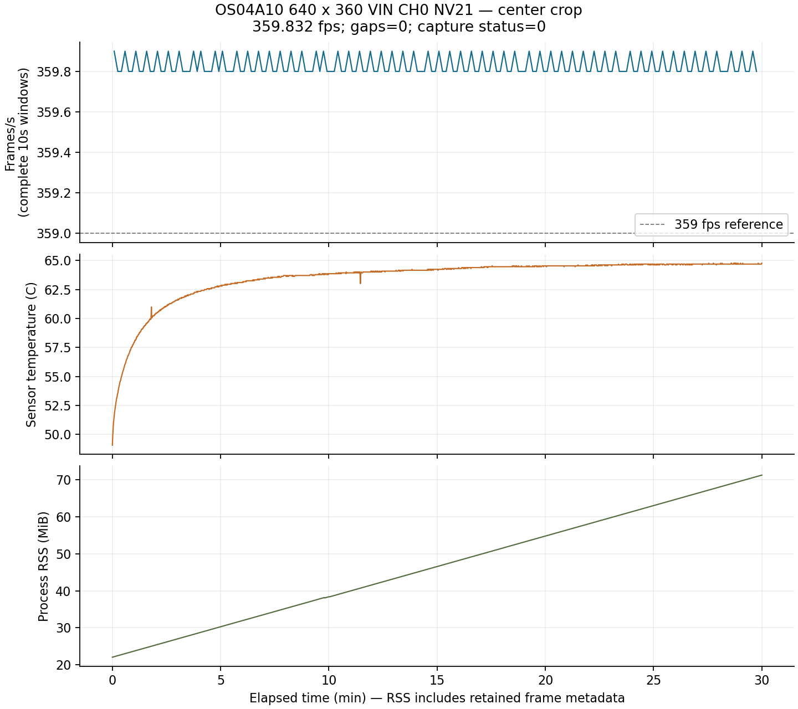

# OS04A10 360fps 问题复现与修复验证 · 2026-09-08

本轮复测在同一 MaixCAM2、同一官方 OS04A10 传感器库上进行，目标为 **640×360、binning 加中心裁剪、360fps**。**将 ITP 内部源队列从1调到4、保持输出队列8后，NV21 连续30分钟采集通过：647,698帧、平均359.832149fps、序号缺失/重复/逆序均为0，MIPI错误为0。** 编码队列积压单独验证。

## 采集失败证据

沿用[前次验证](OFFICIAL_VALIDATION.md)的隔离部署，传感器库 SHA256 仍为 `6fa95adebdf0f904fa4ea94bcc8d7079fbd38998f68e1ccadac9a63c11ad9273`，系统媒体库仍使用固件配套版本。没有更改官方寄存器表、曝光策略、共享 SDK、系统库或业务代码。

| NV21 配置 | 实测时间 | 帧数 | 平均fps | 缺号 | 记录 |
| --- | ---: | ---: | ---: | ---: | --- |
| 输出队列4，ITP默认1 | 约120秒 | 43,180 | 359.832431 | 0 | [分析](../../.maixpy/runs/os04a10-20260908-145553-206773/analysis.json) |
| 输出队列8，ITP默认1 | 约120秒 | 43,180 | 359.831843 | 0 | [分析](../../.maixpy/runs/os04a10-20260908-145815-2e5921/analysis.json) |
| 输出队列8，ITP默认1，目标1800秒 | 109.236秒后停止 | 39,307 | 359.822821 | 1 | [分析](../../.maixpy/runs/os04a10-20260908-150256-2cf469/analysis.json) |
| 输出队列8，ITP改为4 | 约120秒 | 43,180 | 359.832356 | 0 | [分析](../../.maixpy/runs/os04a10-20260908-150832-bf308a/analysis.json) |

失败长测出现序号 **40028→40030**，程序立即返回10。结束快照中 **ITP InFrmDrop=1、CHN OutFrmDrop=0、DEV Lost=0**，MIPI 错误计数为0。缺号附近两次 GetYuvFrame 耗时约5577µs、2749µs，应用持帧约20µs、循环间隙约3µs，没有前次推测的十几毫秒应用停顿。可以把此次缺帧定位到 ITP 输入处；还不能仅凭统计判断 SDK 内部具体哪个调度/缓冲操作导致丢帧。IFE LostCnt=2 在成功对照中也出现，不应把初始化阶段计数直接归入测量缺号。[统计](../../.maixpy/runs/os04a10-20260908-150256-2cf469/vin_statistics_after.txt) · [逐帧耗时](../../.maixpy/runs/os04a10-20260908-150256-2cf469/frames.csv)。

这也说明：平均约359.83fps或两分钟短测通过，不足以证明长期无丢帧；只增加输出通道队列深度没有解决全部问题。

## 已验证的采集修复

在 VI 初始化后、预热测量前调用 SDK 公共接口：

```cpp
AX_VIN_SetPipeSourceDepth(0, AX_VIN_FRAME_SOURCE_ID_ITP, 4);
```

修改前后均用 `AX_VIN_GetPipeSourceDepth` 读取并保存；本机实测从1变为4，各 API 返回0。输出队列保持8。源码为 [official_capture.cpp](official_capture.cpp)，部署参数为 `--itp-depth 4 --queue-depth 8`。此次候选没有启用新增的 `--realtime` 实验选项。逐帧日志新增取帧耗时、持帧耗时、循环间隙与 CPU 编号，健康日志新增读取耗时，便于以后区分应用阻塞与上游丢帧。

30分钟实机结果：**647,698帧，平均359.832149fps，程序退出0**。无取帧/归还错误、序号缺失/重复/逆序或PTS倒退；179个完整10秒窗口为359.8～359.9fps。最终 ITP InFrmDrop=0、CHN OutFrmDrop=0、MIPI错误=0。最高内部温度64.7725℃。HTS/VTS前后仍为732/410，输出640×360与裁剪窗口不变。单次最大取帧间隔16.722ms，但缓冲中的序号仍完整，说明消费时间间隔不等于传感器曝光间隔。[完整分析](../../.maixpy/runs/os04a10-20260908-151159-ff418f/analysis.json) · [配置读回](../../.maixpy/runs/os04a10-20260908-151159-ff418f/itp_depth.json) · [原始帧记录](../../.maixpy/runs/os04a10-20260908-151159-ff418f/frames.csv)。



RSS从22,560KB增至73,012KB，与本轮逐帧保留更多耗时元数据一致；这不是内存泄漏排除试验。此次对照支持增加 ITP 缓冲作为有效修复，但一次长测不能保证所有负载、固件或多次重启条件下永久无丢帧。

## 编码问题及有界尝试

首先修正前次用词：`-2147024349` 是 `0x80070223`，即 **AX_ERR_VENC_QUEUE_FULL（队列满）**，不是 TIMEOUT。以设备配套 SDK 头文件定义为准。

| 尝试 | 观测结果 | 原始运行 |
| --- | --- | --- |
| 同一帧队列满后限时重试20ms | SendFrame 最长约20ms，阻塞采集后仍缺号；不能靠重试宣称恢复全帧 | [150128](../../.maixpy/runs/os04a10-20260908-150128-ccf2f6/run.json) |
| RC源/目标帧率均设360 | AX_VENC_CreateChn 返回非法参数；原来180配置可创建 | [150150](../../.maixpy/runs/os04a10-20260908-150150-b6faf2/run.json) |
| 独立工作线程、32帧所有权队列 | 采集短段无缺号，但队列持续积压到32并拒绝后续帧，退出12 | [150606](../../.maixpy/runs/os04a10-20260908-150606-9f4c3a/run.json) |
| 工作线程加非阻塞取编码流 | 仍积压并出现队列满，退出12 | [151123](../../.maixpy/runs/os04a10-20260908-151123-cbfdb9/run.json) |
| 独立用户池复制NV12后编码 | 前102帧采集/编码完整，但32帧队列已满，拒绝下一帧，退出12；428次QUEUE_FULL | [154304](../../.maixpy/runs/os04a10-20260908-154304-416aa7/run.json) |
| VENC内部输入/输出FIFO改为8 | SDK读回均为8；前240帧完整，随后工作队列仍满并拒绝下一帧，退出12；737次QUEUE_FULL | [154359](../../.maixpy/runs/os04a10-20260908-154359-584398/run.json) |

RC 参数180本身不是实际编码上限的证明；这里的失败结论来自真实队列、提交/输出帧记录和退出码。各失败 run 保留 `venc_config.json`（SDK实际属性读回）、`venc_send.csv`（逐帧耗时/重试/返回码）和 `encoded_frames.csv`，没有补帧或忽略错误后判定通过。

独立用户内存池复制输入像素的对照已上板，依据 SDK sample 的分配、缓存维护、送帧和释放方式实现。其目的在于检验 VIN 共享池输入是否触发编码器不同处理路径；结果仍出现积压，因此未证实输入池元数据是编码瓶颈，不能当作已定位的根因。相关实现：[direct_venc.hpp](direct_venc.hpp)、[vin_venc_queue.hpp](vin_venc_queue.hpp)、[venc_input_copy.hpp](venc_input_copy.hpp)。主机模拟测试覆盖同帧重试、异常退场时所有权释放和 DMA 缓存操作，不代表设备编码性能。

## 当前边界

全视野360fps、公共 Camera/IVPS API 完整消费、业务检测与显示均不在此次已通过项目中。30分钟 NV21 采集即使通过，也不自动证明360fps连续硬件录像成功。前次交付的[一秒360fps视频](../../artifacts/os04a10_official_20260908/crop360-slow30-compatible.mp4)仍是短时原始帧缓存后主机编码，不能描述成板端持续录制。

## 新录制的视频

采用与通过长测相同的官方传感器模式、ITP深度4和输出队列8，另运行一秒NV21原始帧缓存，获得连续360帧，实测359.675831fps、无缺号，程序退出0。停止采集后在主机无损编码，保留所有原始帧，未插帧。[采集证据](../../.maixpy/runs/os04a10-20260908-154445-f020df/analysis.json)。

- [正常速度：360帧/1秒](../../artifacts/os04a10_retest_20260908/crop360-realtime.mp4)。
- [12倍慢放：360帧/12秒，无损版](../../artifacts/os04a10_retest_20260908/crop360-slow30.mp4)。
- [12倍慢放兼容版](../../artifacts/os04a10_retest_20260908/crop360-slow30-compatible.mp4)：H264 High、CRF18有损副本，便于常见播放器观看。

无损版本完成整段解码，逐帧像素与原始NV21转换结果一致；兼容版也完成360帧整段解码。[无损核验](../../artifacts/os04a10_retest_20260908/crop360-video-validation.json) · [兼容版核验](../../artifacts/os04a10_retest_20260908/compatible-video-validation.json)。MP4采用按帧索引生成的CFR播放时间戳，采集原始PTS仍保留于CSV；视频标签的360fps不能替代测得的帧率。这是一秒缓存录像，**不是30分钟录像，也不是持续板端硬件编码**。当前场景为静态桌面，没有受控运动/同步光源计时验证。

## 构建、检查与回退

通过30分钟采集的构建记录：[manifest](../../.maixpy/official-retest/itp-build/manifest.json)、[应用来源与构建](../../.maixpy/official-retest/itp-build/app-build.json)。编码失败对照使用各自独立构建和运行目录保留二进制来源，不覆盖成功版本。汇总所有本轮运行的采集结果、逐帧分析、VENC读回、VIN统计和二进制哈希：[measurements.json](../../artifacts/os04a10_retest_20260908/measurements.json)。

交叉编译、13项现有Python测试、主机C++队列/所有权/复制回归测试通过。新代码都在独立工具目录；主机模拟不用于推断设备性能。`main/src`及共享MaixCDK本轮没有修改。

最后用起始基线的同一程序加载原始 `/opt/lib/libsns_os04a10.so`：5秒151帧、30.281338fps、序号连续、无MIPI错误、退出0。[原始驱动回退复测](../../.maixpy/runs/os04a10-20260908-154552-e611a8/analysis.json)。系统传感器库SHA256仍为 `25f1d2c4e9fdef213dca3fdecf09f98a61d9a52c0704ade31cf6070aeab5bb4c`，启动器为 `daemon=running / launcher=running / autostart=none`，见[最终恢复核验](../../artifacts/os04a10_retest_20260908/final-restore.json)。

## 复现

从项目根目录运行，使用已有设备配置；构建目录应为新目录，以保留原二进制及来源记录。

```bash
export PATH="$PWD/.maixpy/host-tools/sshpass/usr/bin:$PATH"
python3 tools/os04a10_highfps/build_official.py --out .maixpy/official-itp-rebuild
python3 tools/os04a10_highfps/run_device.py \
  --driver-build .maixpy/official-itp-rebuild --official-mode crop360 \
  --seconds 1800 --nv21 --queue-depth 8 --itp-depth 4 \
  --pause-camera-app --system-media-lib --remote-root /root/os04a10-tests
python3 tools/os04a10_highfps/analyze.py RUN_DIRECTORY
```

`--itp-depth` 目前只接入独立直接采集程序，不能直接套到公共 Camera API 或录像程序。编码对照使用 `--direct-venc --record`，并分别显式选择 `--venc-retry`、`--venc-worker`、`--venc-copy` 或 `--venc-depth 8`；它们是诊断选项，不应未经对应实测直接合并为推荐配置。采集使用 NV21，独立硬件录像使用编码器接受的 NV12。
